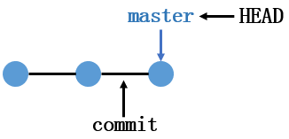
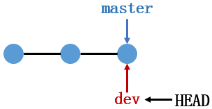
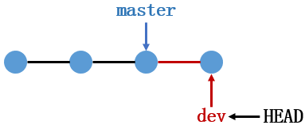
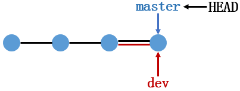
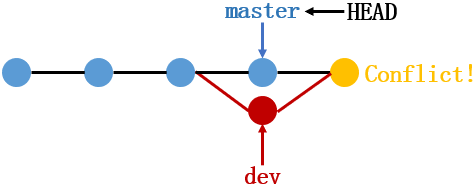

## 分支管理

对于版本库中的每次提交，Git将其串成一条时间线，这条时间线就是一个分支。

版本库存在一条**主分支**，即**master分支**。对于主分支而言，每次在该分支上的提交都会使**master**分支向前移动一步，Git使用**master**指向最新的提交对象，再用**HEAD**指向**master**。如此一来，就能通过**HEAD**指针确定当前分支，以及当前分支指向的提交对象。



当创建新分支**dev**时，Git实际上新建了一个指针叫**dev**，该指针指向**master**指向的提交对象，再将**HEAD**指向**dev**。此时由于**HEAD**指向了**dev**分支，因此当前的分支变成了**dev**。



当**HEAD**指针指向**dev**分支时，随后的每次提交就是针对**dev**分支了。此时每提交一次，**dev**分支就向前移动一步，而**master**指针仍指向原来的提交对象。



当完成了在**dev**分支上的工作后，就可以将**dev**分支与**master**分支合并。具体地，Git直接将**master**指针指向dev当前指向的提交对象，就完成了合并。



若要删除**dev**分支，则直接将**dev**指针删除即可。


### 创建与合并分支

创建，切换以及查看分支。

```bash
$ git branch dev  #创建dev分支
$ git switch dev  #切换分支到dev
$ git branch      #查看所有分支,当前分支由*标出
```

为**git switch**命令添加**-c**参数，可以在创建新分支之后直接切换到新分支。

```bash
$ git switch -c dev  #创建并切换分支到dev
```

**切换到主分支时，如果dev分支上存在未提交到暂存区或版本库的内容，那么在master分支上使用git status仍会看到这些修改内容。**

> 这是因为暂存区和工作区对所有分支而言是公共的，未提交到暂存区或版本库的内容**不属于任何一个分支。**

在分支dev上的工作完成后，需要将dev分支合并到master分支，合并完成后即可删除dev分支。

```bash
$ git merge dev      #将dev分支合并到master分支
$ git branch -d dev  #删除dev分支
```

**当删除某一分支时，必须先切换到其它分支才能正常删除。**


### 遇到冲突时的分支合并

分支合并往往会遇到冲突。当在不同分支上对同一文件的同一个部分进行了不同的修改和提交后，Git在合并这两个分支时便会产生冲突。

1. 新建并切换到**dev**分支，在**dev**分支上对**readme**文件进行修改，将修改添加到暂存区后提交至版本库；
2. 切换到**master**分支，此时在**dev**分支上的修改工作对**master**分支是不可见的；
3. 在**master**分支上对**readme**文件再次进行修改，并将修改内容提交至版本库；
4. 此时将**dev**分支合并到**master**分支时，就会产生冲突，此时的分支状态如下图所示。



使用**git status**可以查看产生冲突的文件。

```bash
$ git status
On branch master
You have unmerged paths.
  (fix conflicts and run "git commit")
  (use "git merge --abort" to abort the merge)

Unmerged paths:
  (use "git add <file>..." to mark resolution)
        both modified:   readme.txt

no changes added to commit (use "git add" and/or "git commit -a")
```

若要解决冲突，只能手动修改产生冲突的文件，修改完成后，再将其提交到版本库中。

**带参数的git log可以查看分支合并图。**

```bash
$ git log --graph --pretty=oneline --abbrev-commit
*   0c4786b (HEAD -> master) solve conflict between master and dev
|\
| * 7650360 (dev) modify readme.txt on dev branch
* | 5b097c4 modify readme.txt on master branch
|/
* e9638ef add readme.txt on dev branch
* 7c58c81 add readme.txt on master
```


### 分支合并策略

默认的分支合并策略是**Fast forward**模式，使用该模式进行分支合并时，Git直接将**master**指向分支的提交对象，因此具有非常快的合并速度。但在这种模式下，删除分支后，将丢掉分支信息。

使用**Fast forward**将**test**分支合并到**master**分支后，**git log**可查看到合并信息；

```bash
$ git log --graph --pretty=oneline --abbrev-commit
* c579d55 (HEAD -> master, test) test branch
* e6100e5 master new commit
```

将**test**分支删除后，再次使用**git log**则无法看到**test**分支的历史信息。

```bash
$ git branch -d test
$ git log --graph --pretty=oneline --abbrev-commit
* c579d55 (HEAD -> master) test branch
* e6100e5 master new commit
```

若要禁用**Fast forward**模式，Git会在合并时生成一个新的**commit**，这样就能从分支历史上看到分支信息，实现方式在合并分支时添加**--no-ff**参数即可。

特别地，由于生成了一个新的**commit**，因此也需要添加**-m**参数。

```bash
$ git merge --no-ff -m "merge with no-ff" test2
$ git branch -d test2
$ git log --graph --pretty=oneline --abbrev-commit
*   e60293c (HEAD -> master) merge with no ff
|\
| * bf0c10d (test2) test2 branch
|/
* c579d55 test branch
* e6100e5 master new commit
```

**常用的分支策略**

- **master**分支应该是非常稳定的，仅用来发布新版本，不能直接在该分支上进行工作；
- 使用**dev**分支进行工作，多人协作时，每人在自己的分支上工作，然后往dev上合并即可。